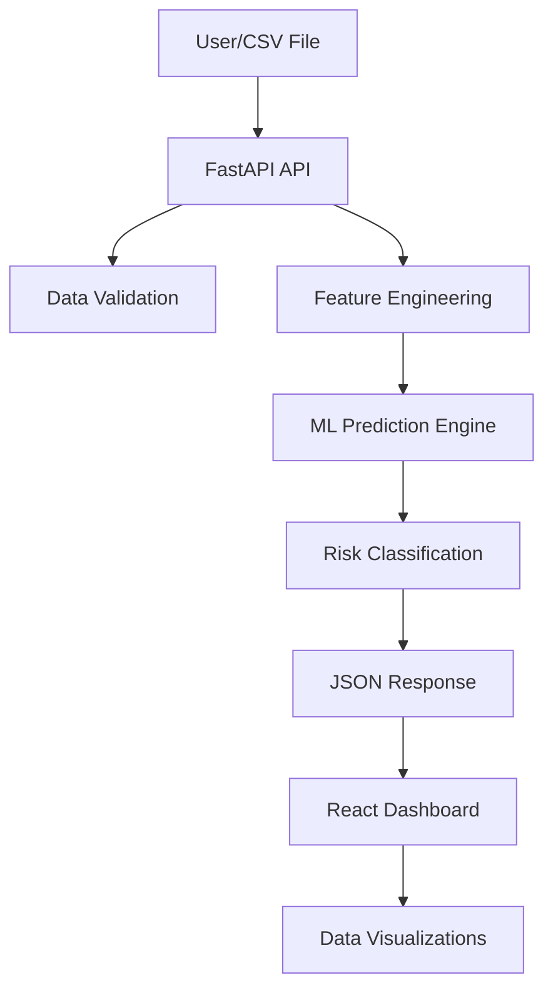

# 🌊 ChurnAI System Workflow & Architecture

This document provides a comprehensive overview of the ChurnAI Enterprise system, detailing the end-to-end data flow, architectural logic, and repository structure.

## 1. High-Level Architecture
The system follows a decoupled architecture with a **FastAPI** backend and a **React (Vite)** frontend.



## 2. Core Operational Phases

### Phase A: Data Ingestion & Sanitization
*   **Source**: Users upload a CSV file or trigger a "Sample Test" via the UI.
*   **Cleaning**: The system performs "Extreme Cleaning" in `app.py`, stripping whitespace, handling multiple encodings (UTF-8, Latin-1, cp1252), and sanitizing column names to match enterprise standards using regex.

### Phase B: Feature Engineering (`features/feature_engineering.py`)
Raw Telco data is transformed into behavioral insights:
*   **TotalCharges Handling**: Converts strings to numeric and handles missing values.
*   **Tenure Categorization**: Bins tenure into stages like 'New', 'Junior', 'Middle', 'Senior', and 'Legend'.
*   **Risk Indicators**: Creates flags for `Month-to-month` contracts and `Electronic check` payments.
*   **Behavioral Intensity**: Calculates a `service_count` based on the number of active services.
*   **Economic Value**: Computes `price_sensitivity` and `clv_proxy` (Customer Lifetime Value).

### Phase C: ML Inference & Training (`training_pipeline.py`)
*   **Unified Benchmarking**: The `training_pipeline.py` script benchmarks 20 different ML algorithms (XGBoost, RandomForest, GradientBoosting, etc.).
*   **Champion Selection**: Automatically selects the model with the highest **ROC-AUC**.
*   **Production Bundle**: The champion is wrapped in an Sklearn Pipeline and saved as `production_pipeline_bundle.joblib`.
*   **Output**: Generates raw probability scores for each customer record in real-time.

### Phase D: Risk Intelligence
Scores are passed through a classification logic:
*   **Critical (>85%)**: Immediate attention required (Red).
*   **At-Risk (60-85%)**: Periodic follow-up recommended (Orange).
*   **Stable (15-60%)**: Baseline retention profile (Yellow).
*   **Loyal (<15%)**: High retention/loyalty profile (Green).

## 3. Data Schema & Field Details
The system expects the **IBM Telco Churn** standard format.

| Feature Group | Fields | Description |
| :--- | :--- | :--- |
| **Demographics** | `gender`, `SeniorCitizen`, `Partner`, `Dependents` | Basic customer profile information. |
| **Services** | `PhoneService`, `InternetService`, `OnlineSecurity`, etc. | Digital services subscribed to by the customer. |
| **Account Info** | `tenure`, `Contract`, `PaperlessBilling`, `PaymentMethod` | Terms of service and billing preferences. |
| **Financials** | `MonthlyCharges`, `TotalCharges` | Revenue metrics used for churn correlation. |
| **Engineered** | `service_count`, `clv_proxy`, `price_sensitivity` | Synthetic features generated at runtime for better accuracy. |

## 4. Repository Directory & Usage
A detailed mapping of the project structure and file responsibilities.

```text
customer_problem/
├── app.py                # 🛠️ Main API Hub. Handles routing, file sanitization, and serves the frontend.
├── training_pipeline.py  # 🚀 Training Engine. Benchmarks 20 models and saves the best one.
├── Dockerfile           # 🐳 Container Logic. Multi-stage build (Node -> Python) for production.
├── requirements.txt     # 📦 Python Dependencies. List of all libraries needed for the ML engine.
├── WORKFLOW.md          # 📖 (This file) Complete system architectural documentation.
├── .github/             # 🤖 Automation.
│   └── workflows/
│       └── pipeline.yml # CI/CD logic for testing and auto-building on GitHub.
├── data/                # 📂 Data Storage.
│   └── raw/             # Contains 'Telco-Customer-Churn.csv' used for sample tests.
├── features/            # 🧠 Intelligence Layer.
│   └── feature_engineering.py # Core logic for transforming raw data into ML-ready features.
├── frontend/            # 💻 Dashboard Layer (React/Vite).
│   ├── src/
│   │   ├── App.jsx      # The "Brain" of the UI. Manages API calls and dashboard state.
│   │   └── index.css    # Premium CSS design tokens and dark-mode styling.
├── models/              # 🏛️ Artifact Store.
│   └── production_pipeline_bundle.joblib # The champion model and scaler.
├── src/                 # 🏗️ Configuration & Shared Libs.
│   ├── config.py        # Centralized path and parameter management.
│   └── models_factory.py # The factory defining the 20 algorithms for benchmarking.
└── tests/               # 🧪 Quality Logic.
    └── test_pipeline.py # Unit tests for ensuring prediction accuracy and API stability.
```

## 5. DevOps & Deployment
*   **Dockerization**: The `Dockerfile` compiles the React app into static assets and serves them via FastAPI to ensure a single, portable unit.
*   **CI/CD**: GitHub Actions verifies backend tests and frontend builds on every commit to 'main'.
*   **Dynamic UI**: The dashboard dynamically updates stats and feature importance based on the metadata generated during the `training_pipeline.py` run.
