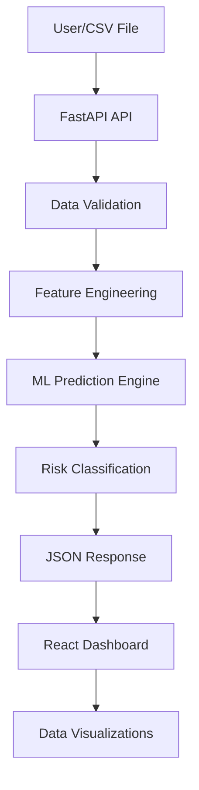

# 🌊 ChurnAI System Workflow

This document outlines the end-to-end data flow and architectural logic of the ChurnAI Enterprise system.

## 1. High-Level Architecture
The system follows a decoupled architecture with a **FastAPI** backend and a **React (Vite)** frontend.

## 2. Core Operational Phases

### Phase A: Data Ingestion & Sanitization
*   **Source**: Users upload a CSV file or trigger a "Sample Test" via the UI.
*   **Cleaning**: The system performs "Extreme Cleaning" in `app.py`, stripping whitespace, handling multiple encodings (UTF-8, Latin-1), and sanitizing column names to match enterprise standards.

### Phase B: Feature Engineering (`features/feature_engineering.py`)
Raw Telco data is transformed into behavioral insights:
*   **TotalCharges Handling**: Converts strings to numeric and handles missing values.
*   **Categorical Encoding**: Maps binary features (Gender, Partner) to integers.
*   **OHE (One-Hot Encoding)**: Expands categorical variables like `Contract` and `InternetService`.

### Phase C: ML Inference (`models/`)
*   **Model**: Uses a **Gradient Boosting Champion** model (`production_pipeline_bundle.joblib`).
*   **Pipeline**: A full Scikit-learn Pipeline including scaling and the estimator.
*   **Output**: Generates raw probability scores for each customer.

### Phase D: Risk Intelligence
Scores are passed through a classification logic:
*   **Critical (>85%)**: Immediate attention (Red).
*   **At-Risk (60-85%)**: Periodic follow-up (Orange).
*   **Stable (15-60%)**: Baseline retention (Yellow).
*   **Loyal (<15%)**: High retention (Green).

## 3. DevOps & Deployment
*   **Dockerization**: A multi-stage `Dockerfile` compiles the React app and packages it with the Python API.
*   **CI/CD**: GitHub Actions (`.github/workflows/pipeline.yml`) runs on every push to:
    1.  Install dependencies.
    2.  Run backend unit tests.
    3.  Build the frontend assets.
    4.  Prepare for cloud deployment (Render/Railway).

## 4. Repository Structure
*   `app.py`: Main entry point and API routing.
*   `frontend/`: React source code (App.jsx is the core UI logic).
*   `models/`: Serialized model artifacts.
*   `tests/`: Quality assurance scripts.
*   `docs/`: Data dictionary and metadata.
